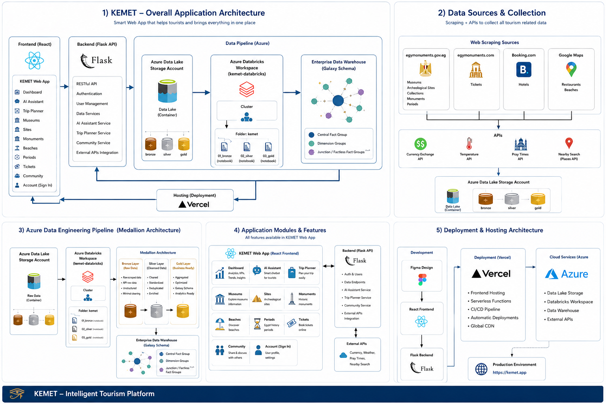
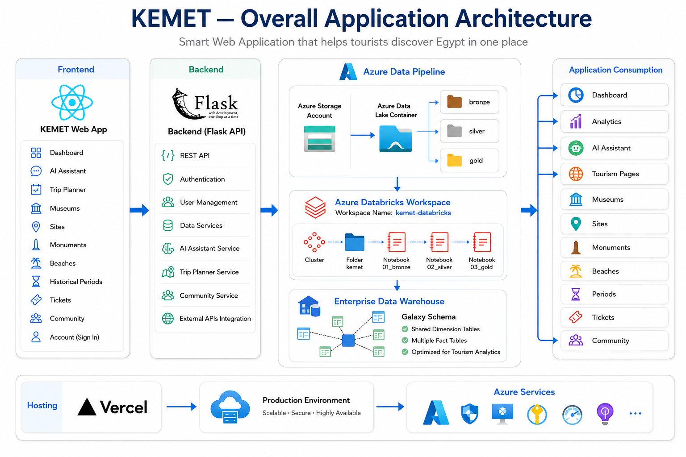
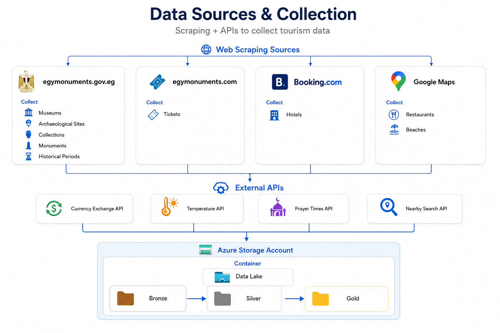
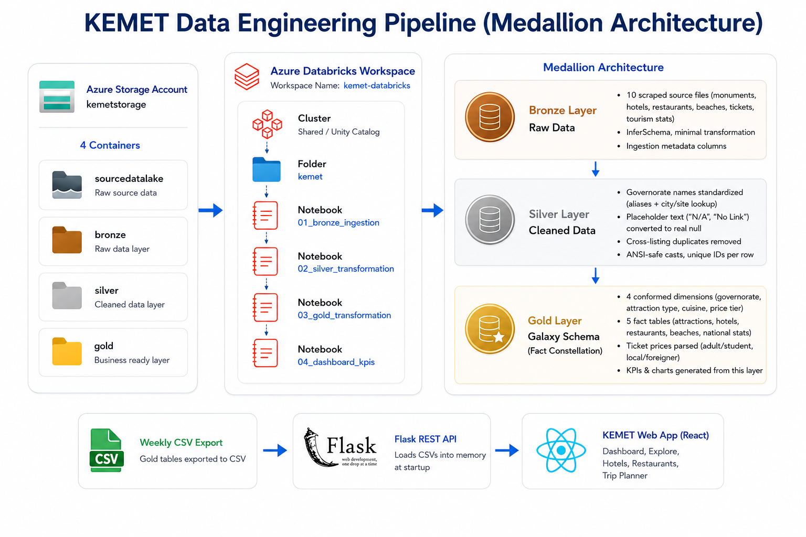
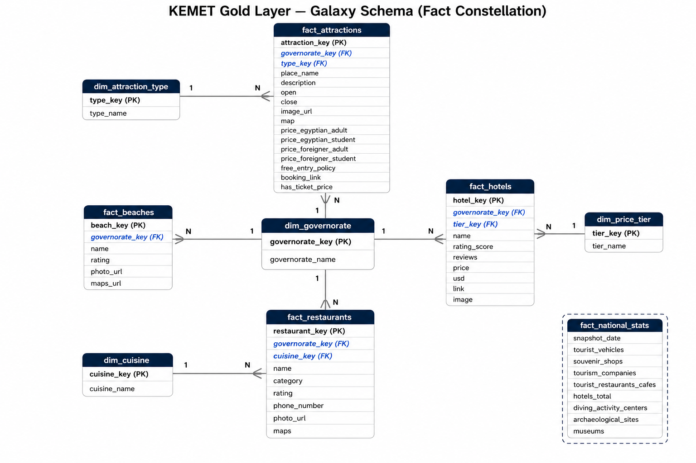
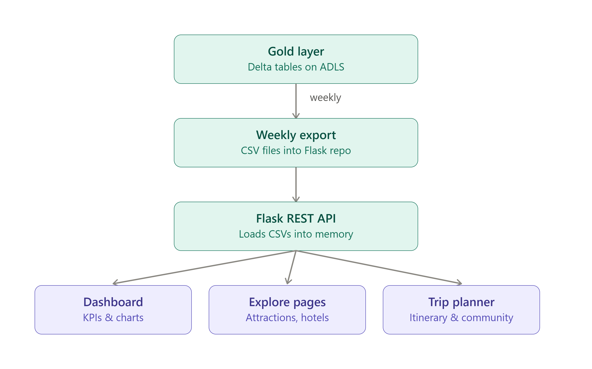
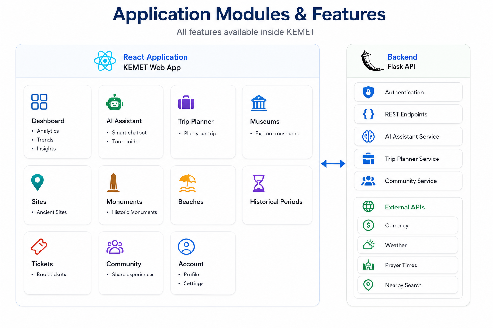
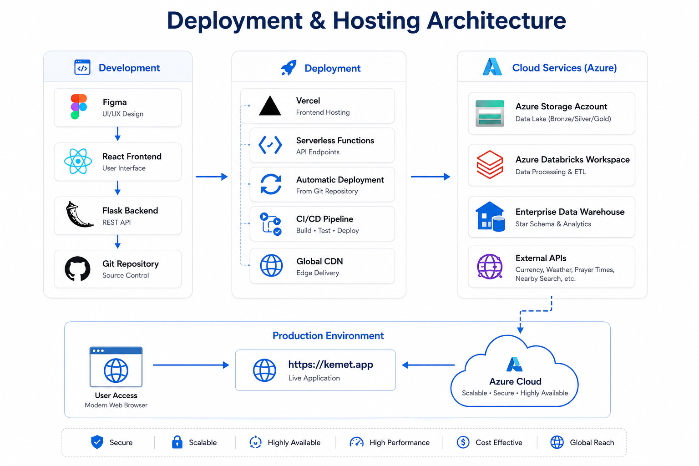

<div align="center">

# 𓁢 KEMET — AI Egypt Tourism Assistant

**An AI-powered platform for Egyptian tourism, heritage & trip planning — built on a cloud-native Medallion data pipeline and a Galaxy Schema analytics layer.**

[](https://kemet-assistant-inky.vercel.app/)
[](#)
[](#)
[](#)
[](#)
[](./LICENSE)

</div>



> **The whole system in one picture:** ① the app itself (frontend + backend + data pipeline), ② where the data comes from, ③ how it gets cleaned (Medallion), ④ what each screen does, ⑤ how it all gets deployed. The sections below walk through each of these five pieces one at a time.


---

## 🌍 Overview

**Kemet** is an AI-powered web platform that helps travelers explore Egypt's tourism, heritage, and hospitality landscape from a single interface — a conversational AI assistant, a live tourism dashboard, curated directories of hotels, restaurants, museums, monuments, archaeological sites, and historical periods, plus a lightweight community feed. All of it lives behind one bilingual, gold-accented Egyptian identity.

| Metric | Value |
|---|---|
| 🗂️ Curated Tourism Datasets | 7 |
| 💬 Chatbot Modes | 3 (Chat / Web Search / RAG) |
| 🌐 Languages | 2 (Arabic & English) |
| 🥇 Medallion Layers | 3 (Bronze / Silver / Gold) |

### Objectives

- Provide a single AI assistant that answers general Egypt-travel questions, searches the live web, and answers questions grounded in curated tourism datasets (RAG).
- Support both Arabic and English input/output with automatic right-to-left / left-to-right rendering.
- Surface live, practical information: weather across major destinations, currency exchange rates, emergency numbers, and useful travel apps.
- Offer browsable, filterable directories of hotels, restaurants, museums, monuments, archaeological sites, and historical periods — all served from one clean, analytics-ready Gold data layer.
- Allow authenticated users to create posts, keep a personal profile, and browse a community feed.

### Problem Statement

Planning a trip to Egypt today means stitching together travel blogs, booking sites, museum listings, weather apps, and currency converters — most of it not tailored to Arabic-speaking users, and none of it combining an AI assistant with curated local data. Kemet solves this by bringing everything into one bilingual, data-driven platform.

---

## ✨ Key Features

- 🤖 **AI Trip Assistant** — ask questions about Egypt in Arabic or English without searching multiple sites.
- 🎯 **Grounded Recommendations** — hotel, restaurant, and museum answers grounded in a real curated dataset, not model memory.
- ⛅ **Live Travel Conditions** — live weather across major cities and current currency exchange rates.
- 🗺️ **Directory Browsing** — filterable hotels, restaurants, museums, monuments, sites, and historical periods.
- 👥 **Community Engagement** — create an account, write posts, and browse a shared community feed.

---

## 🏗 System Architecture

A cloud-native data engineering pipeline feeds a modular React/Flask web application. Raw data is collected, cleaned, and modeled through Azure Databricks before ever reaching the app — the frontend never touches Azure Data Lake or Databricks directly.



> **In simple words:** the user talks to the **React** app → the app calls the **Flask** backend → the backend never touches raw data directly, it only reads from the **Gold** layer that Azure Databricks already cleaned → results flow back up to the Dashboard, AI Assistant, and directory pages.

---

## 📡 Data Sources & Collection

Raw data is gathered from trusted public sources — web scraping and public APIs — creating a continuously updated knowledge base covering hotels, restaurants, museums, monuments, archaeological sites, and historical periods, landed directly into the Bronze layer of the data lake.



> **In simple words:** four websites get scraped for museums, tickets, hotels, restaurants and beaches, and four live APIs add currency, weather, prayer times and nearby places. Everything lands in the **Bronze** folder first — nothing skips the line.

**Sources used:**

| Source | Data Collected |
|---|---|
| egymonuments.gov.eg | Museums, archaeological sites, collections, monuments, historical periods |
| egymonuments.com | Ticket prices |
| Booking.com | Hotels |
| Google Maps | Restaurants, beaches |
| Currency Exchange API | Live exchange rates |
| Temperature API | Live weather |
| Prayer Times API | Prayer times |
| Nearby Search API | Location-based search |

---

## 🥉🥈🥇 Data Engineering Pipeline — Medallion Architecture

All ten scraped source files are processed through three progressively cleaner layers on Azure Databricks before anything reaches the application.



> **In simple words:** think of it as three folders getting progressively tidier. **Bronze** = raw data exactly as scraped. **Silver** = same data, but cleaned (no typos, no duplicates, no "N/A"). **Gold** = the polished, ready-to-use tables the app actually reads from. A weekly job pushes Gold → CSV → Flask → the website.

| Layer | What Happens Here |
|---|---|
| **Bronze** | 10 scraped source files ingested as-is (monuments, hotels, restaurants, beaches, tickets, tourism statistics); `inferSchema`, minimal transformation; ingestion metadata columns added. |
| **Silver** | Governorate names standardized across sources (alias table + city/site lookup); placeholder text such as "N/A" and "No Link" converted to real nulls; cross-listing duplicates removed; ANSI-safe casts; a unique ID generated per row. |
| **Gold** | Modeled as a Galaxy Schema — 4 conformed dimensions and 5 fact tables; ticket prices parsed into adult/student and local/foreigner amounts; this is the layer the dashboard's KPIs and charts are generated from. |

---

## ⭐ Gold Layer — Galaxy Schema

The Gold layer is modeled as a **Galaxy Schema** (fact constellation) rather than a single star: the source data has no natural single transaction, so five fact tables — attractions, hotels, restaurants, beaches, and national statistics — share a set of conformed dimensions instead.



> **In simple words:** one central table (`dim_governorate`) sits in the middle, and five other tables — attractions, hotels, restaurants, beaches, and national stats — all connect to it. So "show me everything in Luxor" pulls from every table at once, using the same governorate name every time.

**Why a Galaxy Schema, not a single Star:**

- Fast analytical queries across every listing type with one shared governorate filter.
- Centralized, consistent tourism data — no duplicated governorate spellings between tables.
- Scalable model — a new fact table (e.g., tours, transport) can conform to the same dimensions later.
- Directly supports both the dashboard's KPIs/charts and the chatbot's RAG retrieval from one source of truth.

---

## 🔄 Gold Layer to Application — Data Flow

Given the dataset's small size (the largest table is ~180 rows) and a weekly refresh cadence, Kemet intentionally skips a database hop: Gold tables are exported to CSV and loaded directly into the Flask API's memory at startup.



> **In simple words:** no live database calls while a tourist is browsing. Once a week the Gold tables get exported to plain CSV files, Flask loads them into memory when it starts up, and the Dashboard, Explore pages, and Trip Planner all read from that fast in-memory copy.

**Why this over a database:**

- No network round-trip to Azure on every request — everything is served from process memory.
- No database dependency to provision, secure, or keep warm on a serverless host.
- The weekly refresh cadence matches a redeploy-on-refresh model with negligible operational cost.

---

## 🧩 Application Modules & Features

The React frontend and Flask backend are organized module-for-module — every directory page the tourist sees has a matching backend service and, ultimately, a Gold-layer table behind it.



> **In simple words:** every card on the left (Dashboard, AI Assistant, Trip Planner, Museums, Sites, Beaches, Periods, Tickets, Community, Account) has a matching service on the right in Flask. Nothing on the frontend is "fake" — each page is backed by a real API endpoint and, ultimately, a Gold table.

---

## 🧠 AI Assistant & RAG Pipeline

The assistant offers three complementary modes, all routed through the same chat interface, so a tourist never has to think about which "mode" answers their question best.

| Mode | How It Works |
|---|---|
| **Chat** | Calls Gemini with Google Search grounding enabled for general-purpose Egypt-travel answers. |
| **Web Search** | Uses a free keyless search backend (with retry/fallback logic) then asks Gemini to answer from those live results. |
| **Data (RAG)** | Retrieves the most relevant chunks from the curated Gold-layer datasets and asks Gemini to answer only from that retrieved context. |

**Retrieval pipeline:**

1. A keyword router narrows the dataset search space before embedding search runs, in Arabic or English.
2. Multilingual embeddings (`paraphrase-multilingual-MiniLM-L12-v2`) power a single retrieval space for both languages.
3. Top-4 retrieval selects the most relevant chunks as grounding context for the model.
4. Directional rendering auto-detects Arabic vs. Latin script to render each reply RTL or LTR correctly.

---

## 🚀 Deployment & Hosting Architecture

Development flows from Figma design through the React frontend and Flask backend, deployed with automatic CI/CD and backed by Azure's managed cloud services.



> **In simple words:** design in **Figma** → build the **React** frontend and **Flask** backend → push to Git → **Vercel** auto-deploys the frontend with a CI/CD pipeline and global CDN, while **Azure** keeps handling storage, data processing, and external APIs → everything meets at **kemet.app**.

| Stage | Tools |
|---|---|
| Design | Figma |
| Frontend | React |
| Backend | Flask (REST API) |
| Source Control | Git |
| Hosting | Vercel (frontend hosting, serverless functions, CI/CD, global CDN) |
| Cloud Services | Azure Storage, Azure Databricks, Enterprise Data Warehouse, External APIs |

**Production:** [https://kemet.app](https://kemet.app) — Secure · Scalable · Highly Available · Cost Effective · Global Reach

---

## 🛠 Technology Stack

| Layer | Technology | Purpose |
|---|---|---|
| Data Collection | Selenium, public APIs | Gathers raw hotel/restaurant/museum/monument data |
| Data Orchestration | Azure Data Factory | Schedules and orchestrates ingestion into the pipeline |
| Data Processing | Azure Databricks | Medallion architecture (Bronze/Silver/Gold) + Galaxy Schema modeling |
| API Middleware | Flask | RESTful APIs delivering curated data & AI services to the platform |
| Frontend | React + Tailwind + Recharts | Multi-page web app with themed navigation and live charts |
| AI — LLM | Google Gemini 2.5 Flash / Flash-Lite | Conversational answers, Google-Search-grounded chat |
| AI — Embeddings | sentence-transformers (multilingual MiniLM) | RAG retrieval over local datasets |
| Web Search | ddgs (DuckDuckGo Search) | Free, keyless real-time web search mode |
| Data Lake | Azure Blob Storage / ADLS | Bronze/Silver/Gold Delta tables and CSV exports |
| Database & Auth | Azure Cosmos DB | User authentication, profiles, posts and community feed |
| External APIs | Open-Meteo, Exchange Rate API | Live weather and currency data for the dashboard |
| Hosting | Vercel + Azure Cloud | Frontend hosting, serverless functions, CI/CD, global CDN |

---

## ✅ Testing & Quality Assurance

- **Chatbot modes** — Chat returns grounded answers; Web Search survives rate limiting; Data mode retrieves from the correct dataset for Arabic and English queries alike.
- **Bilingual rendering** — Arabic renders right-to-left with correctly ordered lists; English renders left-to-right.
- **Rate limiting** — per-minute limits retry automatically once; daily-quota limits surface guidance instead of retrying indefinitely.
- **Dashboard** — weather cards and charts refresh automatically on interval and via manual refresh; hottest/coolest/humid/driest calculations verified against source data.
- **Directories & accounts** — every directory page loads and filters correctly; sign-up, sign-in, and posting work end-to-end.
- **Data pipeline** — Bronze ingestion completes with no unexplained row loss; Silver/Gold transformations verified with row-count and governorate-match reporting at every stage.

### Key Performance Indicators

| KPI | Target | Measurement |
|---|---|---|
| Chatbot response time | < 5 seconds | Submit-to-reply latency |
| RAG retrieval relevance | Top-4 chunks on-topic | Manual spot-check vs. query |
| Bilingual accuracy (AR/EN) | Correct language + direction | Manual RTL/LTR review |
| Dashboard data freshness | ≤ 5 minutes | Weather auto-refresh interval |
| Data pipeline freshness | Weekly Gold-layer refresh | Databricks job run monitoring |
| System uptime | ≥ 99% | Hosting status monitoring |

---

## 📈 Results & Impact

**Key achievements:**

- A single AI assistant covering three complementary answer strategies (general chat, live web search, dataset-grounded RAG).
- Native bilingual support (Arabic/English) with automatic text-direction detection.
- A cloud-native data engineering pipeline (Azure Data Factory + Databricks, Medallion architecture, Galaxy Schema) feeding curated data through a Flask API layer.
- A live, multi-source tourism dashboard combining weather, tourism statistics, currency, and emergency data.
- Seven curated datasets covering hotels, restaurants, museums, monuments, sites, collections, and periods.

**Business impact:**

- 🚀 Faster trip planning — grounded answers, live conditions, and browsable directories in one place.
- 🌍 Wider accessibility — native Arabic support broadens reach beyond English-only tourism tools.
- 🏨 Local visibility — hotels, restaurants, and cultural sites gain a structured, AI-searchable presence.
- 📊 Scalability — the Medallion/Galaxy-Schema pipeline lets datasets be updated and re-modeled independently of the application code.

---

## 🔮 Future Work

- Structured multi-day itinerary planning combining sites, hotels, and restaurants.
- Booking integrations with hotel/restaurant partners.
- Offline / low-connectivity mode for travelers with limited data access.
- A managed vector store to replace in-memory embedding search as datasets grow.

---

## 📁 Repository Structure

```
KEMET/
├── backend/                     # Flask REST API
├── data/                        # Gold-layer CSV exports
├── docker/                      # Container configs
├── frontend/                    # React web application
├── images/                      # Documentation images
│   ├── gold/
│   ├── all_app.png
│   ├── app_features.png
│   ├── data_collection.png
│   ├── deployment.png
│   ├── galaxy_schema.png
│   ├── gold_to_flask.png
│   ├── medallion.png
│   └── overall_architecture.png
├── scraping/                    # Web scraping scripts
├── .gitignore
├── Kemet_Graduation_Documentation.pdf
├── LICENSE
├── presentation.pdf
└── README.md
```

---

## ⚡ Getting Started

```bash
# Clone the repository
git clone https://github.com/nhahub/kemet.git
cd kemet

# Backend setup
cd backend
pip install -r requirements.txt
python app.py

# Frontend setup (in a new terminal)
cd frontend
npm install
npm start
```

> The live production app is available at **[https://kemet.app](https://kemet.app)**.

---

## 👥 Team & Acknowledgments

**AI & Data Engineering Track** — Instructor: **Mohamed Hamed**

| Name | Role | Contribution |
|---|---|---|
| **Muhammed Ayman Elsayegh** | Team Leader / AI Engineer | Gemini integration, RAG pipeline, chatbot architecture |
| **Elsayed Ashraf Bakry** | Data Engineer | Web-scraping/API data collection, Azure Data Factory & Databricks pipeline, Medallion architecture, Galaxy Schema design, Azure Blob Storage & Cosmos DB setup |
| **Ahmed Hassan Mohamed** | Frontend / UI Developer | Application theming, dashboard, directory pages |
| **Yousef Hamdy Yassin** | Backend Developer | Flask REST API middleware, Cosmos DB-based authentication, account & community features |

---

<div align="center">

**KEMET — Intelligent Tourism Platform** 𓁢

</div>
